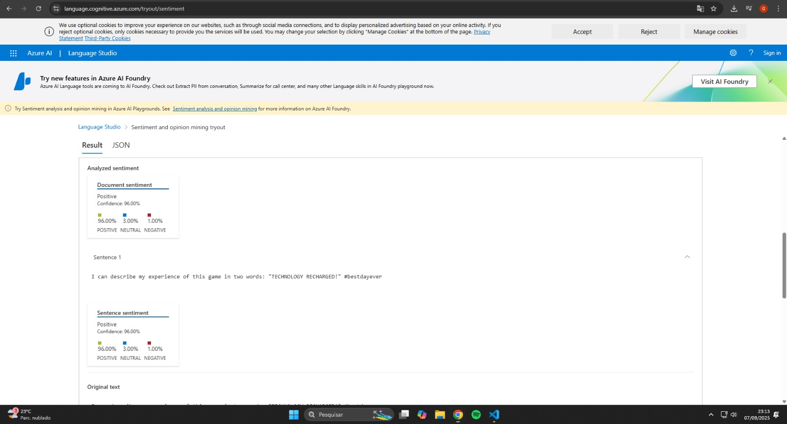
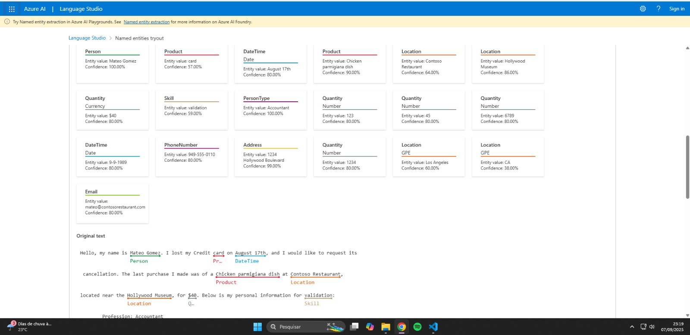
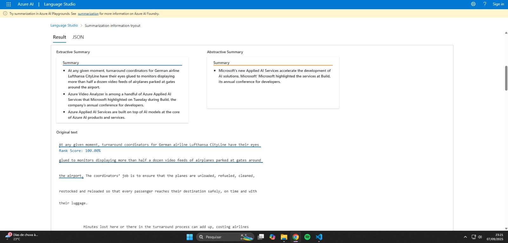

# 🌐 Laboratório Azure Speech Studio e Language Studio

## 📌 Descrição
Este repositório contém minhas anotações e resultados do desafio prático da DIO sobre **Azure Speech Studio** e **Azure Language Studio**.  
O objetivo foi explorar soluções de **inteligência artificial para fala e linguagem natural**, praticando a transcrição de voz, análise de sentimentos e reconhecimento de entidades.  

## 👤 Autor
**Nome:** Gabriel Alves  
**Desafio:** Laboratório de Fala e Linguagem - DIO  
**Data:** Setembro/2025  

---

## 🛠️ Ferramentas Utilizadas
- [Azure Speech Studio](https://speech.microsoft.com/)  
- [Azure Language Studio](https://language.cognitive.azure.com/)  
- GitHub para documentação e versionamento  

---

## 🚀 Passo a Passo Realizado

### 1️⃣ Testes no Speech Studio
- **Conversão de Fala em Texto (STT):**  
  Gravei minha voz dizendo meu nome e objetivo do desafio.  
  O sistema conseguiu transcrever corretamente a fala em texto.  

  !(images/conversao_fala_texto_azure.jpeg)

- **Texto para Fala (TTS):**  
  Digitei uma frase em inglês e o sistema gerou áudio com pronúncia natural.  

  !(images/conversao_texto_fala_azure.jpeg)

  - **Tradução de Fala:**  
  Analisei a ferramenta da Azure de tradução de um vídeo separado pela própria Azure, onde um vídeo em espanhol é convertido para fala e legendas em inglês.  

  !(images/traducao_fala_azure.jpeg)

---

### 2️⃣ Testes no Language Studio

#### 🔹 Análise de Sentimentos
Para as Análises de sentimentos, reconhecimentos de entidades e de resumo de texto, utilizei os textos fornecidos já pelo site da Azure indicado no link.

**Resultado encontrado**  

  

---

#### 🔹 Reconhecimento de Entidades

**Resultado encontrado:**  

  

---

#### 🔹 Resumo de texto

**Resultado encontrado:**  

  

---

## 💡 Insights e Aprendizados
- O **Speech Studio** facilita a criação de soluções de acessibilidade e assistentes virtuais.  
- O **Language Studio** pode ser usado para entender sentimentos de clientes, extrair informações e até resumir textos longos.  
- As duas ferramentas juntas mostram o potencial da IA para transformar **voz em dados úteis** e **texto em informação estruturada**.  

---

## ✅ Conclusão
Este laboratório foi uma ótima oportunidade para praticar IA aplicada em **fala** e **linguagem natural**.  
Com o uso do Azure, é possível implementar soluções poderosas em **educação, saúde, atendimento ao cliente e negócios em geral**.  

📌 Repositório criado como parte do desafio da **Digital Innovation One (DIO)**.  
